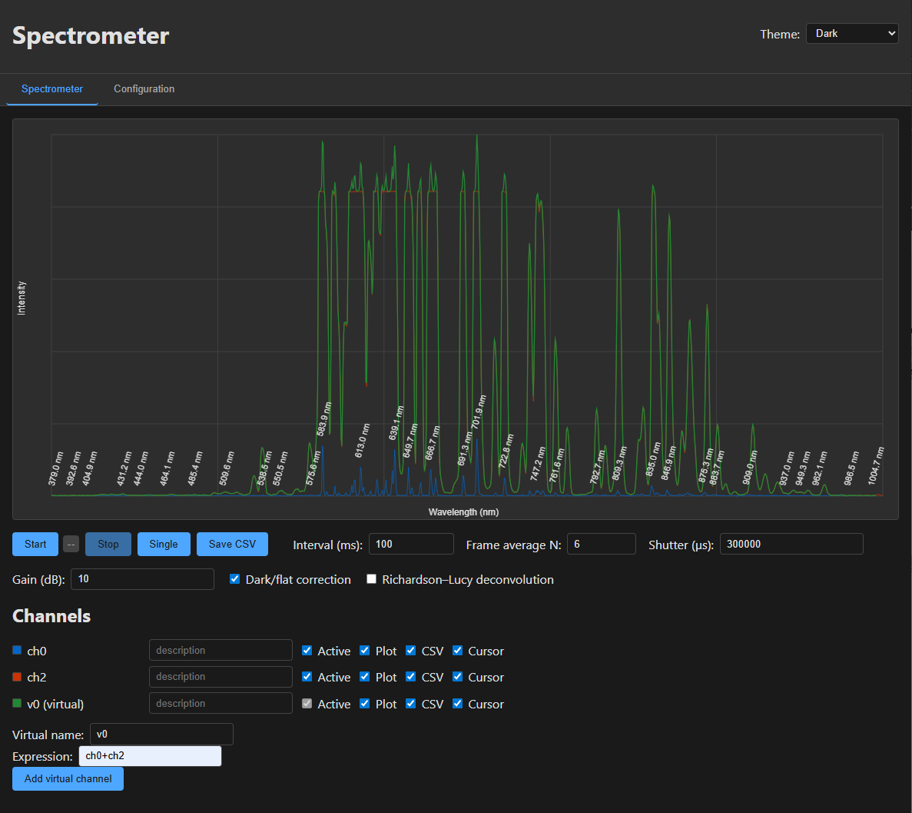
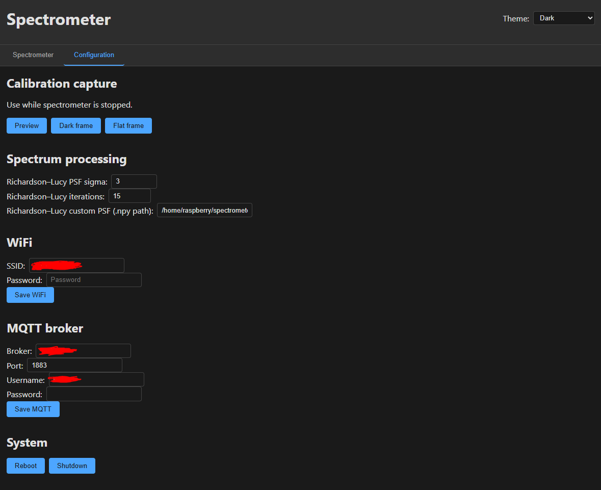

# Webserver Interface Layout

## Screenshots

### Spectrometer tab

### Configuration tab

## Tabs

1. **Spectrometer** – spectrum chart + controls
2. **Configuration** – WiFi, MQTT broker

## Spectrometer Tab

- **Top**: Spectrum chart (X = wavelength nm, Y = intensity)
- **Middle**: Parameter controls (start/stop/single, interval, frame average, dark/flat, Richardson–Lucy)
- **Bottom**: Channel configuration (description for CSV, active, displayed on plot and cursor, saved in CSV) 

**Spectrum chart**:
- Local maxima: wavelength label above each peak, rotated 75°
- Max 1 label per 20 nm (highest peak in each window)
- Interactive cursor: vertical line follows mouse/touch; shows wavelength and intensity
- Touch support

## Configuration Tab

- **Calibration**: preview, dark, flat.
- **Spectrum processing**: Richardson–Lucy PSF sigma, iterations, path to custom PSF
- **WiFi**: SSID, password (for STA mode). Save writes to `wifi_credentials.conf`.
- **MQTT**: Broker, port, username, password. Save updates `env_config.json`.

## Themes

- **Light** – light background, dark text
- **Dark** – dark background, light text
- **High contrast** – black/white
- **Green military** – dark background, green (terminal style)

Theme choice stored in `localStorage` as `spectrometer-theme`.
